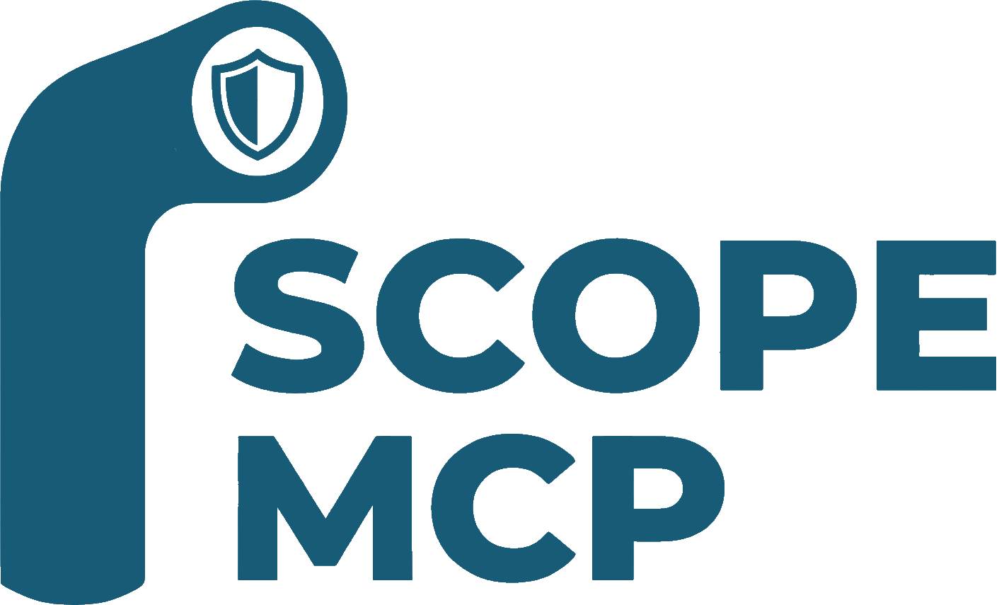
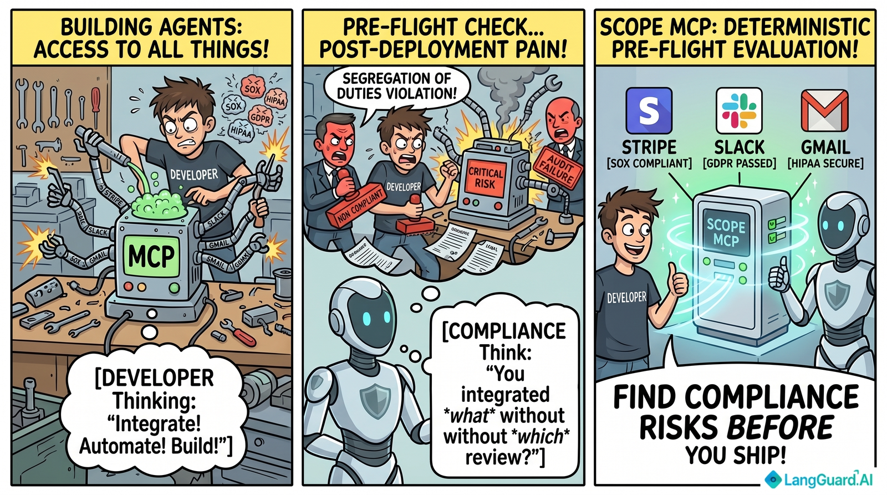
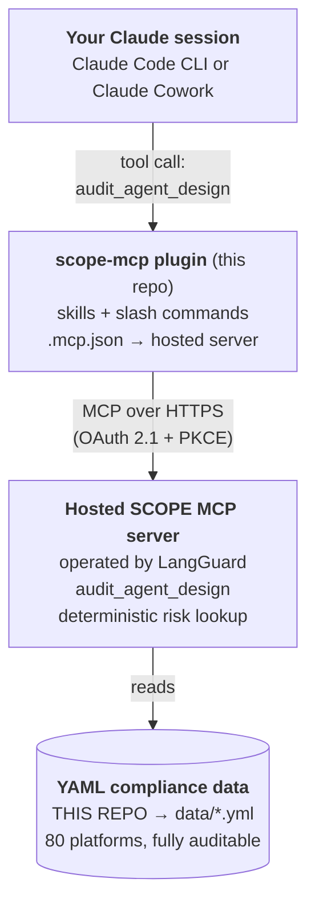

<p align="center">
  
</p>

<p align="center"><b>LangGuard SCOPE</b> - <b>S</b>ecurity, <b>C</b>ompliance &amp; <b>O</b>perational <b>P</b>olicy <b>E</b>valuation.</p>

<p align="center">
  <a href="https://scope-mcp.langguard.ai/register-account"><b>Get an access token</b></a>
  ·
  <a href="https://discord.gg/TPmBYR6pV"><b>Join the Discord</b></a>
  ·
  <a href="https://github.com/LangGuard-AI/scope-mcp/issues/new?template=data-revision.yml"><b>File a data revision</b></a>
</p>

<p align="center">
  
</p>

## Why this exists

Agentic workflows have changed what "automation" means inside an organization. A single Claude agent today can be granted a dozen MCP tools across Salesforce, Stripe, GitHub, Slack, Gmail, a payroll system, an observability stack, a vector store - and every one of those tools is an action the agent can take on your behalf. The granularity that made integrations feel safe a decade ago (one narrowly-scoped credential per script, one trigger, one path through your data) is gone. Agents hold real authority over real systems, and they hold it across the same boundary lines that compliance frameworks were drawn around.

Compliance review has not caught up. SOC 2, GDPR, HIPAA, PCI, SOX, the EU AI Act - these regimes were designed around human actors and traditional applications. Their controls land at the project level, in annual audits, in change-management reviews, in vendor questionnaires. There is no equivalent of a linter or static-analysis pass for the question that actually matters when you're building an agent: **"what compliance and risk exposure am I taking on by attaching these specific tools?"** The result is that exposure gets noticed late, in production, after the agent has been running for a while - typically when somebody finally maps the attack surface for an audit and discovers the agent has `slack.read_direct_messages` (PHI, attorney-client privilege, internal HR data) or `stripe.create_refund` (SOX-relevant, segregation-of-duties violation, PCI scope) on its toolbelt.

Runtime guardrails help, but most agent harnesses don't enforce policy at runtime - and even when they do, runtime is too late. The shipping decision was already made; the agent is already deployed; the data has already moved.

SCOPE runs at the design moment. As you describe an agent - *"an agent that watches Stripe for failed payments, looks up the customer in Salesforce, and posts to Slack"* - it produces a compliance posture report immediately. Risk levels per action, regulatory regimes triggered, segregation-of-duties red flags, concrete scoping recommendations. You see the exposure **before** the agent ships, while you still have cheap options: drop a tool, swap a write for a read, gate a critical action behind human approval, or document the regulatory exposure for a real compliance review.

Two design choices make the report trustworthy enough to use in actual change-management workflows:

- **Deterministic, not generated.** The risk levels and regime tags come from a curated database. The same input produces the same output, every time. That's auditable in a way LLM output isn't - there's no debate about hallucinations, no flickering classifications between runs.
- **Open data.** The 80+ YAMLs in [`data/`](./data) are in this public repo. You can read every classification this plugin will ever emit. If you think `slack.read_direct_messages` is over-tagged with HIPAA for your context, or that a Stripe action's confidence should be `medium` rather than `high`, the data is right there to challenge - open an [issue or PR](./CONTRIBUTING.md).

## What you get

A Claude plugin that runs a **pre-flight evaluation** on agentic workflows you're building. Tell SCOPE which MCP tools, connectors, or API actions your agent will be permitted to invoke and it produces a deterministic report:

- A **risk level** for every action (`low` / `medium` / `high` / `critical`)
- The **business impact** in one sentence
- Which **regulatory regimes** the action touches (25 codes - GDPR, HIPAA, PCI, SOX, SOC 2, EU AI Act, NY DFS 500, and more)
- Whether the action raises a **segregation-of-duties** concern
- A **recommendation**: `proceed`, `proceed_with_audit_trail`, `require_human_review`, `require_human_approval`, or `block_and_require_human_approval`

## Quickstart

### 1. Get a SCOPE access token

Self-service signup is at **[scope-mcp.langguard.ai/register-account](https://scope-mcp.langguard.ai/register-account)**. Enter your name, email, and (optional) opt-in for product updates, and we'll email your `cp_…` API token within seconds.

Three things to know before you submit:

- **One token per email.** If you lose it, email [support@langguard.ai](mailto:support@langguard.ai) — we don't have a way to recover it (we hash tokens at storage time), but we can invalidate the old one and issue a replacement.
- **Save the token immediately.** It's shown only once, in the email; we cannot fetch it later.
- **Token tier**: self-signup tokens default to a free rate limit (10 requests / minute). For higher volumes, contact [support@langguard.ai](mailto:support@langguard.ai).

### 2. Install the plugin

#### Claude Cowork

> **Demo video**: [Installing SCOPE in Claude Cowork](https://youtu.be/7bVYyXjIPGU)

1. **Add the plugin** in Claude Cowork: Customize → Personal Plugins → *Click the + icon* → Create Plugin → Add Marketplace → paste `LangGuard-AI/scope-mcp` as the  URL. Then, click on the Scope MCP plugin entry, and click the `Install` button.
2. **Authorize via OAuth.** Under 'Personal Plugins, 'Scope mcp', 'Connectors', click the 'Install' button, followed by 'Add'. Then, click the 'Connect' button. Paste the `cp_…` token from your signup email in the Client Secret field, and enter anything you want into the Client ID field. Claude Cowork stores the authorization; you don't see the token again.
3. **Allow the plugin to run.** Claude Cowork prompts you to approve the plugin's tool access. Choose **Always allow** (or the equivalent in your build) so SCOPE's audit tool can fire without re-prompting on every call.
4. Start designing an agent — SCOPE's auto-trigger skill fires the moment you describe one.

#### Claude Code (desktop app / GUI)

1. **Open Claude Code's plugin manager.** In any chat, type `/plugin` to open the interactive plugin chooser, or open the **Plugins** panel from the app's settings/sidebar (the exact location depends on your Claude Code version — recent builds expose it both ways).
2. **Add a marketplace.** Choose **Add marketplace** and paste `https://github.com/LangGuard-AI/scope-mcp` as the source.
3. **Install the plugin.** From the resolved marketplace, select **scope-mcp** and confirm install. Claude Code wires up the bundled skills (`audit`, `compliance-check`, `curate`) and the plugin's MCP server config in one step.
4. **Allow the plugin to run.** Claude Code prompts you to approve the plugin's tool access on first use. Choose **Always allow** so subsequent MCP calls don't re-prompt — otherwise every `/scope-mcp:audit …` invocation will pause for confirmation.
5. **Authorize on first MCP call.** Claude Code then starts an OAuth flow against the hosted SCOPE server. Paste your `cp_…` token from your signup email when the consent page asks for it; Claude Code reuses the resulting authorization across subsequent sessions.

#### Claude Code CLI

```bash
# Add this repo as a plugin marketplace
/plugin marketplace add LangGuard-AI/scope-mcp

# Install the plugin
/plugin install scope-mcp@scope-mcp-local
```

The plugin ships an `.mcp.json` that points Claude Code at the hosted SCOPE MCP server over HTTP. The first time you trigger an MCP call (e.g. `/scope-mcp:audit …`), Claude Code prompts you twice:

1. **Approve the plugin's tool access.** Choose **Always allow** so subsequent calls don't re-prompt.
2. **Authorize via OAuth.** Paste your `cp_…` token from your signup email when the consent page opens. Claude Code reuses the resulting authorization across sessions.

#### Codex

The end-to-end install (skills + MCP server in one shot) goes through the `/plugins` slash command in the Codex TUI:

1. Launch Codex interactively:
   ```bash
   codex
   ```
2. Inside Codex, type:
   ```
   /plugins
   ```
3. Choose **Add marketplace** and paste:
   ```
   LangGuard-AI/scope-mcp
   ```
4. From the resolved marketplace, select **scope-mcp** and confirm install. Codex copies the bundled skills (`audit`, `compliance-check`, `curate`) into `~/.codex/skills/` and registers the plugin's MCP server config.
5. On the first MCP call, [`mcp-remote`](https://github.com/geelen/mcp-remote) opens a browser to the SCOPE consent page — paste your `cp_…` token from the signup email. The resulting access token caches under `~/.mcp-auth/` and is reused silently across Codex sessions.

> Requires **Node 18+** on `PATH` (the bridge uses `npx` on first run; the package is then cached by npm).

> If `/plugins` Add Marketplace fails with "Failed to add marketplace from the provided source," or the chooser doesn't list `scope-mcp` after a successful add, you likely have a stale cached entry from an earlier broken state. Reset and retry from a shell:
> ```bash
> # Remove whichever name(s) show up under [marketplaces.*] in ~/.codex/config.toml.
> codex plugin marketplace remove scope-mcp 2>/dev/null
> codex plugin marketplace remove scope-mcp-local 2>/dev/null
>
> # Clear the resolved + staging caches.
> rm -rf ~/.codex/.tmp/marketplaces/scope-mcp ~/.codex/.tmp/marketplaces/.staging
>
> # Re-add fresh.
> codex plugin marketplace add LangGuard-AI/scope-mcp
> ```
> Then go back into `codex` and run `/plugins` to install the plugin.

##### MCP-only install (skills omitted)

If you only need the `audit_agent_design` MCP tool — without the design-time auto-trigger skill or the `/scope-mcp:audit` workflow — you can register the MCP server directly from a shell:

```bash
codex mcp add scope-mcp -- npx -y mcp-remote@latest https://scope-mcp.langguard.ai/mcp
```

This bypasses the plugin marketplace entirely. You get the audit tool but lose the skill prompts that fire automatically when Codex sees you describing an agent. Use this path for headless / CI scenarios where the interactive `/plugins` flow doesn't apply.

#### OpenClaw

[OpenClaw](https://openclaw.ai/) speaks streamable-HTTP MCP natively, so the install is a single CLI command after you have a `cp_…` token — no `npx` bridge needed (unlike Codex):

```bash
openclaw mcp set scope-mcp '{
  "url": "https://scope-mcp.langguard.ai/mcp",
  "transport": "streamable-http",
  "headers": {"Authorization": "Bearer cp_…paste_token_here…"}
}'
```

The `audit_agent_design` tool is now wired up to your OpenClaw agent. OpenClaw redacts the bearer token in its logs and status output, so the secret doesn't leak through OpenClaw's own logging.

To also pick up the design-time auto-trigger and `/scope-mcp:audit` skills (the same `SKILL.md` files Claude Code and Codex use — OpenClaw uses the identical format), copy them into `~/.openclaw/skills/`:

```bash
mkdir -p ~/.openclaw/skills/audit ~/.openclaw/skills/compliance-check ~/.openclaw/skills/curate
for s in audit compliance-check curate; do
  curl -s "https://raw.githubusercontent.com/LangGuard-AI/scope-mcp/main/plugins/scope-mcp/skills/${s}/SKILL.md" \
    > ~/.openclaw/skills/${s}/SKILL.md
done
```

The skills route their tool calls to the `scope-mcp` server you registered above. Workspace-scoped install (per-project) is also supported — drop the same files into `<project>/skills/`; OpenClaw resolves Workspace > Local > Bundled.

### 3. Verify the install

In any session, type:

```
/scope-mcp:audit salesforce.* slack.post_message
```

You should see a markdown table with risk levels and compliance tags for each Salesforce action plus the Slack post.

## Usage

### Auto-trigger (recommended)

Just describe the agent you're building:

> *"I'm building an agent that watches our Stripe webhooks for failed payments, looks up the customer in Salesforce, and posts to Slack."*

SCOPE's `compliance-check` skill triggers automatically, derives the implied tool surface (`stripe.*`, `salesforce.*`, `slack.post_message`), and produces a build advisory.

### Explicit - `/scope-mcp:audit`

Pass anything: tool ids, connector wildcards, bare platform names, or a prose description.

```
/scope-mcp:audit github.merge_pull_request slack.read_direct_messages
/scope-mcp:audit hubspot.*
/scope-mcp:audit "an agent that updates SF opportunities when a deal closes"
```

The output adapts: design-time scoping advice when you're iterating on what to attach, run-time pre-flight gating when you're about to execute a fixed set of tools.

### Curate - `/scope-mcp:curate`

Create or refresh a YAML compliance data file for a single MCP server platform. Pass a GitHub repo URL, a vendor MCP docs page, a claude.com/connectors link, or a local file path to MCP server source code.

```
/scope-mcp:curate https://github.com/stripe/agent-toolkit
/scope-mcp:curate https://docs.slack.dev/ai/slack-mcp-server
/scope-mcp:curate ./path/to/local/mcp-server
```

The skill walks through an interactive 6-step workflow: resolve the source, confirm platform metadata, enumerate the tool surface (preserving verbatim tool names), classify each tool for risk/compliance/SoD, write the YAML to `data/`, and present a summary. It asks for confirmation at each step and flags low-confidence entries for review.

## Example output

```
## Compliance posture for this agent

3 actions across 2 platforms. Highest observed risk: **critical**.
Regulatory regimes touched: GDPR, UK_GDPR, CCPA, HIPAA, SOC2, ISO_27001.
Segregation-of-duties red flags: 1.

| Tool                          | Risk     | Compliance                          | SoD |
|-------------------------------|----------|-------------------------------------|-----|
| slack.read_direct_messages    | critical | GDPR, UK_GDPR, CCPA, HIPAA, SOC2…  | ⚠   |
| slack.post_message            | low      | -                                   |     |
| github.merge_pull_request     | high     | SOX, COSO, SOC2, ISO_27001          |     |

### Why this matters
- slack.read_direct_messages - Reads private 1:1 and small-group conversations;
  may include regulated health or personnel data.
- github.merge_pull_request - Bypasses code-review gating that audit logs depend on.

### Recommendations
- Drop unless required: slack.read_direct_messages
- Gate behind human approval: github.merge_pull_request
```

## Architecture



The plugin in this repo distributes the *interface*: skills (`audit`, `compliance-check`, `curate`), the `/scope-mcp:audit` and `/scope-mcp:curate` slash commands, and an `.mcp.json` manifest pointing at the hosted SCOPE MCP server. It also distributes the *data*: the 80+ per-platform YAML files in [`data/`](./data) that catalogue every MCP tool the server knows about and how each one is classified.

When you run an audit, your Claude session calls the hosted MCP server over HTTPS. The server reads its data from the YAML files in this repository - that's the canonical source of truth, publicly auditable, and updated by pull request. You can read every classification this plugin will ever emit by browsing [`data/`](./data).

## Data and schema

Full field-by-field schema documentation is in [**SCHEMA.md**](./SCHEMA.md).

```
data/
├── salesforce.yml          # canonical schema reference
├── github.yml
├── slack.yml
├── stripe.yml
├── notion.yml
├── hubspot.yml
└── ... 75+ more
```

Each file declares the platform's actions in this shape:

```yaml
schema_version: "1.0"
platform: stripe
display_name: Stripe
source: langguard-editorial
updated: "2026-05"
actions:
  - id: stripe.create_refund
    object: Refund
    action: create_refund
    category: Financial
    risk: critical
    business_impact: "Moves money back to the cardholder; touches payment rails and the GL."
    compliance: [SOX, COSO, PCI, SOC2, ISO_27001, PSD2]
    sod_concern: true
    confidence: high
    access_methods: [REST, MCP]
```

Tool ids are **verbatim** from each connector's published MCP `tools/list` documentation - case, vendor prefixes, and plurals preserved. So `notion.notion-create-pages` (kebab-case + vendor prefix) and `atlassian.createJiraIssue` (camelCase) appear exactly as the upstream MCP server emits them. This is what makes lookup deterministic at audit time.

## Compliance regimes covered

A closed list of 25 canonical codes. The audit returns the subset triggered by your tool selection.

| Category | Codes |
|---|---|
| **Privacy** | `GDPR`, `UK_GDPR`, `CCPA`, `PIPEDA`, `LGPD`, `APPI`, `PIPL`, `POPIA` |
| **Industry / sector data** | `HIPAA`, `PCI`, `GLBA`, `FERPA`, `COPPA` |
| **Financial reporting** | `SOX`, `COSO` |
| **Security frameworks** | `SOC2`, `ISO_27001`, `NIST_CSF` |
| **AI regulation** | `EU_AI_ACT`, `NIST_AI_RMF`, `CO_AI_ACT` |
| **Sector-specific** | `FEDRAMP`, `NY_DFS_500`, `PSD2`, `FDA_PART_11` |

## Repository layout

```
scope-mcp/
├── README.md, LICENSE, CONTRIBUTING.md, logo.png
├── .github/ISSUE_TEMPLATE/                    # data-revision form + config
├── .agents/plugins/marketplace.json           # Codex marketplace catalog
├── .claude-plugin/marketplace.json            # Claude marketplace catalog
├── data/                                      # per-platform YAML compliance
│                                              # data (~80 files, hot-synced to S3
│                                              # by the hosted MCP server)
└── plugins/
    └── scope-mcp/                             # the plugin itself
        ├── .codex-plugin/plugin.json          # Codex plugin manifest
        ├── .claude-plugin/plugin.json         # Claude plugin manifest
        ├── .mcp.json                          # universal stdio bridge (mcp-remote)
        └── skills/
            ├── audit/SKILL.md                 # /scope-mcp:audit (explicit)
            ├── compliance-check/SKILL.md      # auto-trigger (design-time)
            └── curate/SKILL.md                # /scope-mcp:curate (data file creator)
```

The marketplace catalogs at the repo root point both Claude and Codex at `./plugins/scope-mcp/`, where the actual plugin lives. `data/` stays at the repo root because the hosted MCP server reads it directly from S3, independent of plugin install — community PRs and issue-driven corrections land there.

## Contributing

**The data is the project.** SCOPE is only as good as the YAMLs in [`data/`](./data), and we want community input on every part of them - risk levels, business-impact wording, regime tagging, missing tools, hallucinated tools, calibration of `confidence`. If you've used a connector in a regulated context and our classification feels off, we want to hear about it.

Two ways to contribute, both welcome:

- **Open an issue** if you have feedback but don't want to write YAML. A one-paragraph "I think `stripe.create_refund` should also tag `NY_DFS_500` because…" is plenty - we'll do the rest.
- **Open a PR** if you want to make the change directly. Edit or add files under [`data/`](./data) following the schema in `data/salesforce.yml`. Approved PRs reach production within 60 minutes of merge.

See [CONTRIBUTING.md](./CONTRIBUTING.md) for issue templates, the three hard rules for new data (verbatim tool ids, closed regime allowlist, calibrated confidence), and a PR checklist.

## Limitations

- **Coverage**: ~80 platforms today, expanding. If you audit a tool SCOPE doesn't recognize, it surfaces as `unmapped` and the audit recommends human review by default.
- **Not a runtime gate**: SCOPE produces an advisory report. It does not enforce execution policy at runtime - **that's a separate problem solved by LangGuard. Interested? Find out more at [our website](https://langguard.ai)**
- **Editorial judgment**: Risk and regime classifications reflect informed industry consensus, not legal advice. Sector-specific applicability (e.g. whether HIPAA applies to a given Slack workspace) depends on your deployment and is flagged in `business_impact` prose.

## Privacy

**The hosted SCOPE MCP server does not log requests.** Specifically:

- **No request body is ever persisted.**
- **No IP address or access token is ever stored alongside submitted content.** The only place a client IP touches the system is a per-IP rate-limit counter for `/register-account` and `/browse`, and that's keyed on `sha256(ip)` with the row containing only a count + TTL. The IP-hash partition has no correlation key to any row that holds submitted data — they cannot be joined.
- **API Gateway access logs are not enabled.**
- **No third-party telemetry, analytics, or APM agent**

## Contact

- **Discord (community support, fastest live help)**: [discord.gg/TPmBYR6pV](https://discord.gg/TPmBYR6pV)
- **Get an access token**: self-service at [scope-mcp.langguard.ai/register-account](https://scope-mcp.langguard.ai/register-account).
- **Lost your token, rate-limit increase, commercial inquiries**: [support@langguard.ai](mailto:support@langguard.ai).
- **Issues / data corrections**: [file a Data revision](https://github.com/LangGuard-AI/scope-mcp/issues/new?template=data-revision.yml) on this repo.
