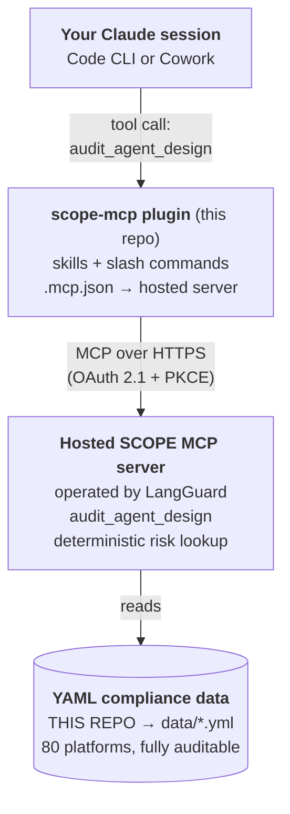

<p align="center">
  
</p>

<p align="center"><b>SCOPE</b> — <b>S</b>ecurity, <b>C</b>ompliance &amp; <b>O</b>perational <b>P</b>olicy <b>E</b>valuation.</p>

A Claude plugin that runs a **pre-flight compliance evaluation** on agentic workflows you're building. Tell SCOPE which MCP tools, connectors, or API actions your agent will be permitted to invoke and it produces a deterministic report:

- A **risk level** for every action (`low` / `medium` / `high` / `critical`)
- The **business impact** in one sentence
- Which **regulatory regimes** the action touches (25 codes — GDPR, HIPAA, PCI, SOX, SOC 2, EU AI Act, NY DFS 500, and more)
- Whether the action raises a **segregation-of-duties** concern
- A **recommendation**: `proceed`, `proceed_with_audit_trail`, `require_human_review`, `require_human_approval`, or `block_and_require_human_approval`

The data is curated, deterministic, and lives openly in this repo's [`data/`](./data) directory — 80+ platforms with verbatim MCP tool ids sourced from each connector's published documentation. There's no model in the loop deciding what's risky; the lookup is exact.

## Quickstart

### Cowork (recommended)

1. **Add the plugin** in Cowork: Settings → Plugins → *Add plugin* → paste this repo's URL.
2. When prompted, **authorize via OAuth**. You'll be redirected to enter a SCOPE access token (request one from [LangGuard](mailto:scope-mcp@langguard.ai)). Cowork stores the authorization; you don't see the token again.
3. Start designing an agent — SCOPE's auto-trigger skill fires the moment you describe one.

### Claude Code CLI

```bash
# Add this repo as a plugin marketplace
/plugin marketplace add <github-org>/scope-mcp

# Install the plugin
/plugin install scope-mcp@scope-mcp-local
```

On first invocation, Claude Code will run the OAuth flow against the hosted SCOPE server (callback on `localhost:3118`) and cache the resulting access token. To request a SCOPE token, contact [LangGuard](mailto:scope-mcp@langguard.ai).

### Verify the install

In any session, type:

```
/scope-mcp:audit salesforce.* slack.post_message
```

You should see a markdown table with risk levels and compliance tags for each Salesforce action plus the Slack post.

## Usage

### Auto-trigger (recommended)

Just describe the agent you're building:

> *"I'm building an agent that watches our Stripe webhooks for failed payments, looks up the customer in Salesforce, and posts to Slack."*

SCOPE's `compliance-check` skill triggers automatically, derives the implied tool surface (`stripe.*`, `salesforce.*`, `slack.post_message`), and produces a build advisory.

### Explicit — `/scope-mcp:audit`

Pass anything: tool ids, connector wildcards, bare platform names, or a prose description.

```
/scope-mcp:audit github.merge_pull_request slack.read_direct_messages
/scope-mcp:audit hubspot.*
/scope-mcp:audit "an agent that updates SF opportunities when a deal closes"
```

The output adapts: design-time scoping advice when you're iterating on what to attach, run-time pre-flight gating when you're about to execute a fixed set of tools.

## Example output

```
## Compliance posture for this agent

3 actions across 2 platforms. Highest observed risk: **critical**.
Regulatory regimes touched: GDPR, UK_GDPR, CCPA, HIPAA, SOC2, ISO_27001.
Segregation-of-duties red flags: 1.

| Tool                          | Risk     | Compliance                          | SoD |
|-------------------------------|----------|-------------------------------------|-----|
| slack.read_direct_messages    | critical | GDPR, UK_GDPR, CCPA, HIPAA, SOC2…  | ⚠   |
| slack.post_message            | low      | —                                   |     |
| github.merge_pull_request     | high     | SOX, COSO, SOC2, ISO_27001          |     |

### Why this matters
- slack.read_direct_messages — Reads private 1:1 and small-group conversations;
  may include regulated health or personnel data.
- github.merge_pull_request — Bypasses code-review gating that audit logs depend on.

### Recommendations
- Drop unless required: slack.read_direct_messages
- Gate behind human approval: github.merge_pull_request
```

## Architecture



The plugin in this repo distributes the *interface*: skills (`audit`, `compliance-check`), the `/scope-mcp:audit` slash command, and an `.mcp.json` manifest pointing at the hosted SCOPE MCP server. It also distributes the *data*: the 80+ per-platform YAML files in [`data/`](./data) that catalogue every MCP tool the server knows about and how each one is classified.

When you run an audit, your Claude session calls the hosted MCP server over HTTPS. The server reads its data from the YAML files in this repository — that's the canonical source of truth, publicly auditable, and updated by pull request. You can read every classification this plugin will ever emit by browsing [`data/`](./data).

## Data and schema

```
data/
├── salesforce.yml          # canonical schema reference
├── github.yml
├── slack.yml
├── stripe.yml
├── notion.yml
├── hubspot.yml
└── ... 75+ more
```

Each file declares the platform's actions in this shape:

```yaml
schema_version: "1.0"
platform: stripe
display_name: Stripe
source: langguard-editorial
updated: "2026-05"
actions:
  - id: stripe.create_refund
    object: Refund
    action: create_refund
    category: Financial
    risk: critical
    business_impact: "Moves money back to the cardholder; touches payment rails and the GL."
    compliance: [SOX, COSO, PCI, SOC2, ISO_27001, PSD2]
    sod_concern: true
    confidence: high
    access_methods: [REST, MCP]
```

Tool ids are **verbatim** from each connector's published MCP `tools/list` documentation — case, vendor prefixes, and plurals preserved. So `notion.notion-create-pages` (kebab-case + vendor prefix) and `atlassian.createJiraIssue` (camelCase) appear exactly as the upstream MCP server emits them. This is what makes lookup deterministic at audit time.

## Compliance regimes covered

A closed list of 25 canonical codes. The audit returns the subset triggered by your tool selection.

| Category | Codes |
|---|---|
| **Privacy** | `GDPR`, `UK_GDPR`, `CCPA`, `PIPEDA`, `LGPD`, `APPI`, `PIPL`, `POPIA` |
| **Industry / sector data** | `HIPAA`, `PCI`, `GLBA`, `FERPA`, `COPPA` |
| **Financial reporting** | `SOX`, `COSO` |
| **Security frameworks** | `SOC2`, `ISO_27001`, `NIST_CSF` |
| **AI regulation** | `EU_AI_ACT`, `NIST_AI_RMF`, `CO_AI_ACT` |
| **Sector-specific** | `FEDRAMP`, `NY_DFS_500`, `PSD2`, `FDA_PART_11` |

## Repository layout

```
scope-mcp/
├── .claude-plugin/
│   ├── plugin.json              # plugin manifest
│   └── marketplace.json         # marketplace catalog
├── .mcp.json                    # points at the hosted MCP server URL
├── skills/
│   ├── compliance-check/SKILL.md   # auto-trigger (proactive design-time)
│   └── audit/SKILL.md              # /scope-mcp:audit (explicit)
├── data/                        # per-platform YAML compliance data (~80 files)
├── CHANGELOG.md
└── README.md
```

## Contributing

**The data is the project.** SCOPE is only as good as the YAMLs in [`data/`](./data), and we want community input on every part of them — risk levels, business-impact wording, regime tagging, missing tools, hallucinated tools, calibration of `confidence`. If you've used a connector in a regulated context and our classification feels off, we want to hear about it.

Two ways to contribute, both welcome:

- **Open an issue** if you have feedback but don't want to write YAML. A one-paragraph "I think `stripe.create_refund` should also tag `NY_DFS_500` because…" is plenty — we'll do the rest.
- **Open a PR** if you want to make the change directly. Edit or add files under [`data/`](./data) following the schema in `data/salesforce.yml`. Approved PRs reach production within 60 minutes of merge.

See [CONTRIBUTING.md](./CONTRIBUTING.md) for issue templates, the three hard rules for new data (verbatim tool ids, closed regime allowlist, calibrated confidence), and a PR checklist.

## Limitations

- **Coverage**: ~80 platforms today, expanding. If you audit a tool SCOPE doesn't recognize, it surfaces as `unmapped` and the audit recommends human review by default.
- **Not a runtime gate**: SCOPE produces an advisory report. It does not enforce execution policy at runtime — that's a separate problem your agent harness solves.
- **Editorial judgment**: Risk and regime classifications reflect informed industry consensus, not legal advice. Sector-specific applicability (e.g. whether HIPAA applies to a given Slack workspace) depends on your deployment and is flagged in `business_impact` prose.

## Status

Production POC. Data is curated against published MCP `tools/list` documentation per connector; coverage is expanding. The report shape and tool contract are stable.

## Contact

- Issues / data corrections: open a GitHub issue on this repo.
- Access tokens, commercial inquiries: [scope-mcp@langguard.ai](mailto:scope-mcp@langguard.ai) (LangGuard).
